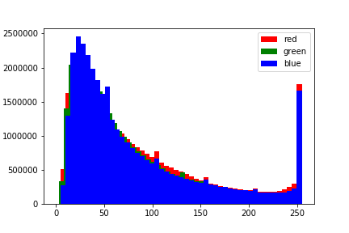
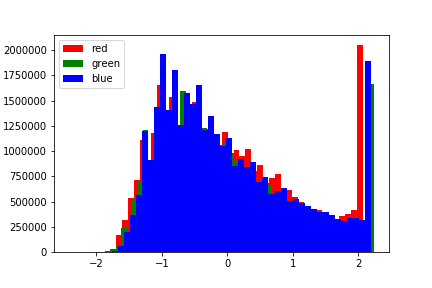
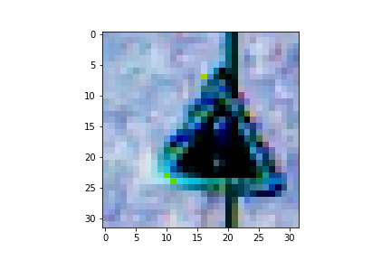
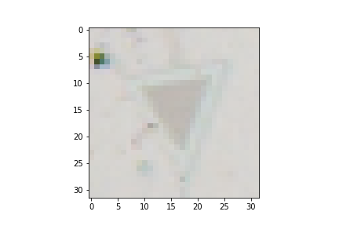
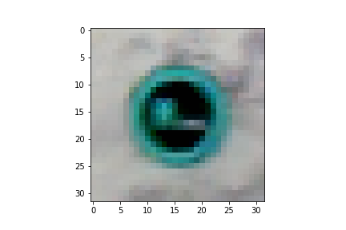
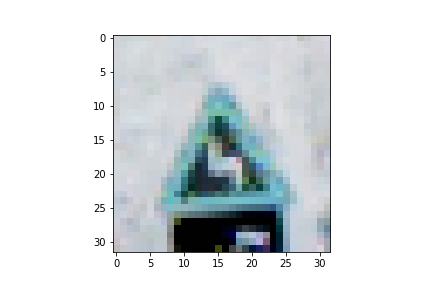
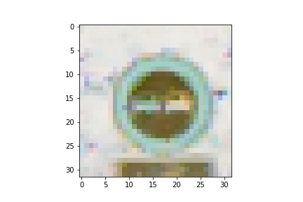
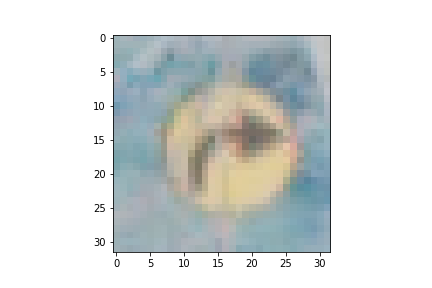
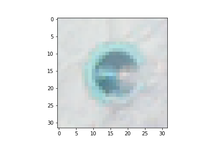

# Traffic Sign Classifier Project - John Chauvin

# 1. Data Set Summary and Exploration

I used numpy.shape to determine the number of training and testing samples, and the image data shape. I used the numpy.unique function to determine the unique class labels, and then used the python len() function to measure the length of this set and determine the number of classes. Here are the results:

Number of training samples: 34,799

Number of test samples: 12,630

Image data shape: 32 x 32

Number of classes: 43

# 2. Exploratory Visualization of the Dataset

I used the matplotlib.hist() function to generate histograms of the training, validation, and test sets. These are shown below. The classes are clearly very unevenly represented within each set, with some classes have many examples and other classes having very few. This is a big concern when used with a metric such as mean cross entropy since the model can simply focus on those classes with many examples and completely ignore the ones with few examples to achieve an overall low mean cross entropy. This is where other metrics (such precision and recall) might be more appropriate. Another option would be to supplement these sets with other examples, including rotated versions of the existing examples. For this project, I did not do anything to change the distributions within these sets.


# Design and Test of Model Architecture

# 1. Preprocessing

I performed a two-step prepocessing routine for the input data. First, I subtracted the mean and divided by the standard deviation for each color channel separately. Here is a histogram of the resulting pixel values for each channel:



Noticing the extreme skew in these distributions, I then applied a square root transform in an attempt to make the distribution closer to normal. Here is the result:



The distribution is still not very normal, but I determined it was close enough. I chose to keep the three color channels vice converting to grayscale since I assumed that three channels would provide more information that could be exploited by the neural network than just one. As I mentioned above, I chose not to address the unequal representation of the classes within the training, validation, and test sets. If I had not been able to achieve the required 93% validation accuracy, that would have been my next step.

# 2. Final Model Architecture

For my final neural network architecture, I started with the LeNet architecture and made some small adjustments, changing some parameters in the fully-connected layer and adding one more layer. I also changed the activations to tanh and added dropout with a keep probability of 0.90. The architecture is described as follows:

Input - 32 x 32 x 3 image

Layer 1 - Convolution - 32x32x3 -> 28x28x6 (5x5 kernel, 1x1 stride, valid padding, tanh activation, max pooling)

Max Pooling - 28x28x6 -> 14x14x6 (2x2 stride)

Layer 2 - Convolution - 14x14x6 -> 10x10x16 (5x5 kernel, 1x1 stride, valid padding, tanh activation, max pooling)

Max Pooling - 28x28x6 -> 14x14x6 (2x2 stride)

Flattening - 14x14x6 -> 400

Layer 3 - Fully-Connected - 400 -> 240

Layer 4 - Fully-Connected - 240 -> 168

Layer 5 - Fully-Connected - 168 -> 43

I cannot say which of the changes to the LeNet architecture had the greatest effect on the results. I was having a lot of difficulty achieveing reasonable validation accuracy, so I kept making changes to the architecture. Eventually I realized that I had made a mistake in my normalization code, and once I fixed that I was able to achieve >93% accuracy so I decided not to make any further changes to the architecture.

# 3. Training the Model

To train the model, I used the following hyperparameters:

Optimizer - ADAM

Number of Epochs - 20

Batch Size - 128

Learning Rate - 0.001

Dropout Keep Probability - 0.90

# 4. Approach for Finding a Solution

The first architecture I tried was the LeNet architecture, with which I achieved a validation accuracy of about 89% (before normalization). 

I couldn't determine exactly what was wrong with this architecture, other than it was not producing the required validation accuracy.

I decided added a new layer to the fully-connected network, hoping that this would combine the features from the convolution layers in new ways to improve the classification. I added dropout regularization hoping to reduce any overfitting during training. I changed the activation to tanh just to see what effect that might have. I also increased the number of epochs to 20 to give the training a chance to reach higher accuracies (the accuracies seemed to still be increasing after 10 epochs).

I tuned the number of epochs by doubling this number to 20. I tuned the dropout keep probability by re-running the training with a few different values. Values below 0.90 seemed to be holding back the accuracy improvement rate. I also tuned the number of nodes in the fully-connected layers by arbitrarily doubling them.

The most important design choice that I made was in the preprocessing. I believe that made the biggest improvement in validation accuracy. All of the changes that I made to the LeNet architecture were simply trial and error attempts to get the validation accuracy above the 93% threshold. When I kept making changes and still found low accuracies, I did some further testing on my normalization code and discovered an error. When I fixed this, I was suddenly able to exceed the validation accuracy threshold. I decided to keep the architecture as-is after this.

Here are the resulting accuracies:

Training Accuracy: 100%

Validation Accuracy: 95.6%

Test Accuracy: 93.4%

# Test Model on New Images

# 1. New Examples of German Traffic Signs

Here are seven new images that I found on the web:









These new images look quite a bit different from the images in the training database. Specifically, the color scheme for these new images appears artificial, with more light blue and aqua tones than we would expect to see in real life traffic signs. Also, some of the new images seem faded, which I suspect is just a result of poor contrast. I was particularly worried that the change in color scheme might result in low accuracy, given that my reasoning for keeping all three channels instead of converting to grayscale was so that the network might be able to exploit this information to make better classifications.

# 2. Model Predictions on New Images
Here are the results of the prediction:

    TRUTH               PREDICTION
1. Traffic Signals | Traffic Signals
2. Yield | Yield
3. No Passing for... | No Passing for...
4. Double Curve | Double Curve
5. No Passing | No Passing
6. Turn Right Ahead | Turn Right Ahead
7. No Passing | No Passing

The prediction accuracy was 100%. This is consistent with the test accuracy.
# 3. Model Certainty

The code for making these predictions is in the cell under the "Predict Sign Type for Each Image" heading in the Ipython (Jupyter) notebook.

The model showed high certainty in classifying these new images. All predictions had selection probabilities of over 99%.


```python

```
